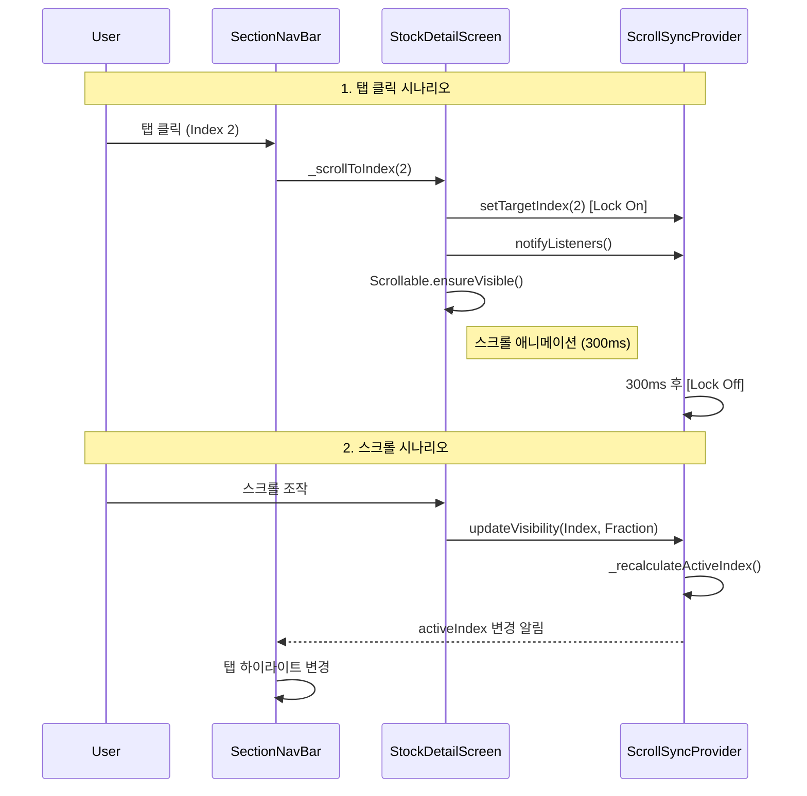

# Lucy Assignment

이 프로젝트는 주식 관심종목(Watchlist) 및 상세 정보(Stock Detail)를 제공하는 Flutter 애플리케이션입니다.
Clean Architecture와 Provider 패턴을 기반으로 구현되었으며, 실시간 주가 업데이트를 위한 소켓 데이터 처리가 포함되어 있습니다.

## 🚀 실행 방법 (Execution)

### 1. 환경 변수 설정 (.env)

프로젝트 루트에 `.env` 파일을 생성하고 다음 내용을 추가하세요.

```properties
LOGO_DEV_TOKEN=********
```

### 2. 의존성 설치 및 코드 생성

Makefile이 포함되어 있어 간편하게 실행할 수 있습니다.

```bash
make get    # 의존성 설치 (flutter pub get)
make build  # 코드 생성 (build_runner & l10n)
```

### 3. 앱 실행

```bash
make run    # 앱 실행 (flutter run)
```

> **참고**: `make` 명령어를 사용할 수 없는 환경(Windows 등)에서는 `Makefile` 내용을 참고하여 직접 커맨드를 실행하세요.

---

## 🏗️ 아키텍처 설명 (Architecture)

이 프로젝트는 **Feature-first Clean Architecture**를 따릅니다.

### 1. 폴더 구조

```text
lib/src/
├── core/           # 공통 유틸리티, 네트워크, DI, 디자인 시스템
├── feature/        # 기능 단위 모듈 (watchlist, stock, stock_detail 등)
│   ├── data/       # Data Layer (DataSource, RepositoryImpl, Model)
│   ├── domain/     # Domain Layer (Entity, Repository Interface, UseCase)
│   └── presentation/ # Presentation Layer (Screen, Widget, Provider)
└── main.dart       # 앱 진입점
```

### 2. 주요 기술 스택

- **State Management**: `Provider`, `ChangeNotifier`
- **Networking**: `Dio` (REST), `WebSocket` (Real-time data simulation)
- **Reactive**: `RxDart` (Stream transforming, throttling)
- **Dependency Injection**: `GetIt`
- **Code Generation**: `Freezed`, `JsonSerializable`

---

## 📱 종목 상세 페이지: 섹션 네비게이션 & 하이라이팅 구현

종목 상세 페이지(`StockDetailScreen`)는 스크롤 위치에 따라 상단 탭이 자동으로 변경되고, 탭 클릭 시 해당 위치로 스크롤되는 **양방향 동기화(Bi-directional Sync)** UI를 구현했습니다.

### 1. 핵심 컴포넌트

| 컴포넌트 | 역할 |
| --- | --- |
| **ScrollSyncProvider** | 현재 활성화된 섹션 인덱스(`activeIndex`)와 각 섹션의 가시성(`visibility`)을 관리하는 상태 저장소입니다. |
| **SectionDetector** | `VisibilityDetector`를 사용하여 각 섹션이 화면에 얼마나 보이는지(visibleFraction)를 감지하고 Provider에 보고합니다. |
| **SectionNavBar** | `SliverPersistentHeader`로 구현된 상단 고정 탭입니다. Provider의 상태를 구독하여 현재 탭을 하이라이팅합니다. |
| **StockDetailScreen** | `CustomScrollView` 내에 섹션들을 배치하고, `GlobalKey`를 사용하여 스크롤 이동을 제어합니다. |

### 2. 구현 방식

#### A. 스크롤 → 탭 변경 (Scroll Processing)

1. 사용자가 스크롤을 이동하면 각 `SectionDetector`가 자신의 가시성 비율(`visibleFraction`)을 `ScrollSyncProvider`에 업데이트합니다.
2. `ScrollSyncProvider`는 가장 많이 보이는 섹션(Max Visibility)을 계산하여 `activeIndex`를 갱신합니다.
3. `SectionNavBar`는 변경된 `activeIndex`를 감지하여 해당 탭을 강조 표시하고, 탭 바의 스크롤 위치를 조정합니다.

#### B. 탭 클릭 → 스크롤 이동 (Tab Click Handling)

1. 사용자가 탭을 클릭하면 `_scrollToIndex(index)` 함수가 호출됩니다.
2. `StockDetailScreen`은 미리 할당된 `GlobalKey`를 사용하여 해당 섹션의 `BuildContext`를 찾습니다.
3. `Scrollable.ensureVisible()` 메서드를 사용하여 해당 섹션이 화면 상단에 오도록 부드럽게 스크롤합니다.
4. 스크롤 애니메이션 중에는 `ScrollSyncProvider`의 자동 감지 로직을 잠시 비활성화하여 탭이 튀는 현상을 방지합니다.

이 방식은 스크롤 오프셋을 직접 계산하는 방식보다 **유연(Flexible)**하며, 섹션의 높이가 동적으로 변하더라도 정확하게 동작합니다.

#### C. 엣지 케이스 처리 (Race Condition Handling)

탭을 클릭하여 스크롤이 자동으로 이동하는 동안, `ScrollSyncProvider`는 `SectionDetector`로부터 지속적인 가시성 업데이트 이벤트를 받게 됩니다. 이로 인해 탭 바가 의도치 않게 다른 인덱스로 튀는(Jumping) 현상이 발생할 수 있습니다.

이를 방지하기 위해 **Scroll Locking** 기법을 도입했습니다:

1. 탭 클릭 시 `_isProgrammaticScroll` 플래그를 `true`로 설정하여 자동 감지 로직을 일시 차단합니다.
2. 스크롤 애니메이션 시간(300ms) 동안 상태 업데이트를 무시합니다.
3. 애니메이션 종료 후 플래그를 해제하여 다시 사용자의 스크롤 입력을 감지합니다.

#### D. 활성 탭 판단 알고리즘 (Visibility Strategy)

단순히 특정 오프셋(Offset) 도달 여부로 현재 섹션을 판단할 경우, 섹션의 높이가 화면보다 작거나 매우 큰 상황에서 부정확할 수 있습니다.

따라서 **Max Visibility Strategy**를 적용했습니다:

1. `_visibilityMap`에 각 섹션의 화면 노출 비율(0.0 ~ 1.0)을 실시간으로 수집합니다.
2. 노출 비율(fraction)이 가장 높은 섹션을 현재 활성 섹션으로 판단합니다.

이를 통해 사용자가 **"실제로 가장 많이 보고 있는 콘텐츠"**의 탭을 정확하게 활성화합니다.


